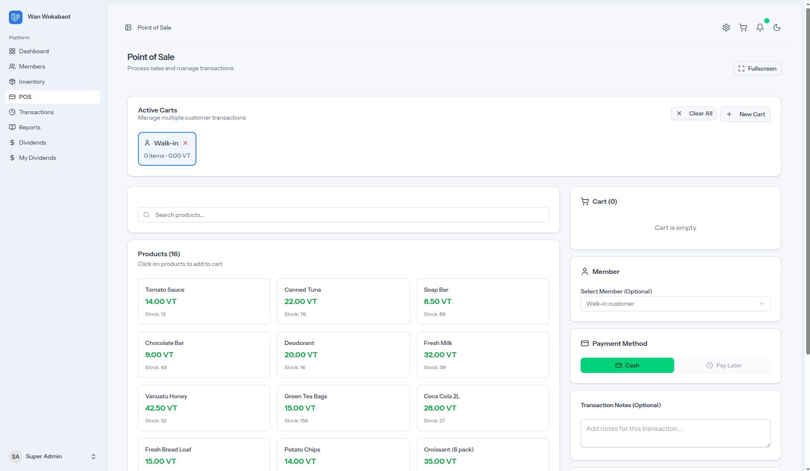
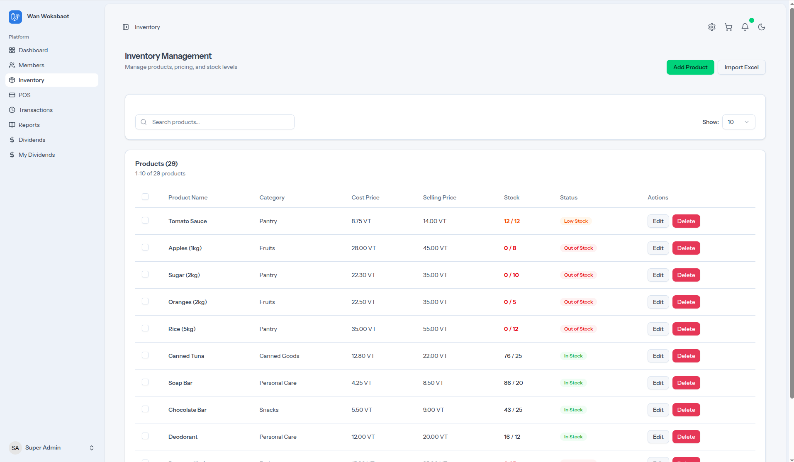
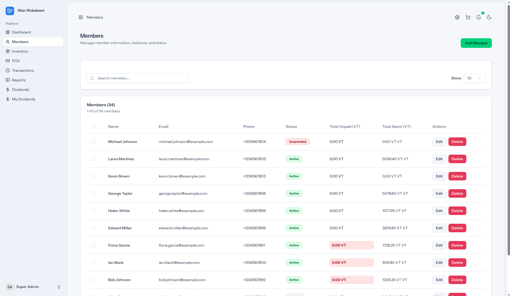
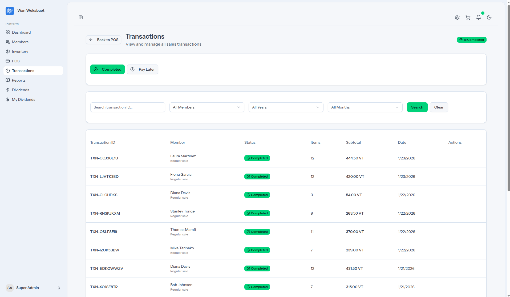
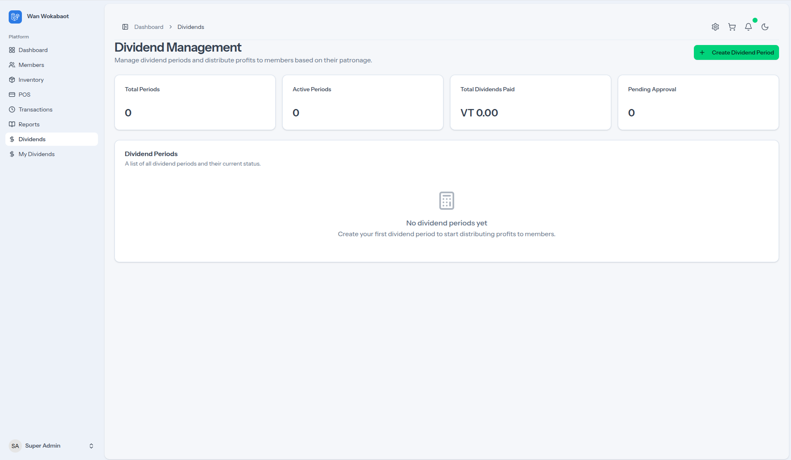

# Wan Wokabaot

A modern POS + inventory management web application built with **Laravel** and **Inertia.js (React + TypeScript)**.

This repository contains:
- A Laravel backend (authentication, authorization, APIs, data access)
- A React SPA frontend served via Inertia (pages, layouts, components)
- A Falcon-inspired UI theme (light/dark) and dashboard charts

---

## Screenshots

Dashboard (Light)


Dashboard (Dark)


POS



Inventory



Low Stock Notification


Members



Transactions



Reports


Dividends



Dividends - Create Period


Inventory - Add Product


Add New Member


---

## Key Features

- **POS (Point of Sale)**
  - Cart-based checkout flow
  - Pending carts support (stored in the browser) to allow saving work-in-progress sales
- **Inventory Management**
  - Product catalog management
  - Stock tracking (`current_stock`) and low-stock thresholds (`minimum_stock`)
  - Inventory table supports sorting (including out-of-stock first)
- **Low stock notifications**
  - Top-bar notification dropdown listing low-stock items
  - “View inventory (out of stock first)” deep-link
- **Members**
  - Member listing and management
  - Balance distribution charts (dashboard)
- **Transactions**
  - Completed and pending transaction management
  - Safe stock reconciliation when editing pending transactions (row locking + transactions)
- **Dividends**
  - Period creation and payout workflows
- **Theming**
  - Falcon-inspired **light/dark** theme
  - Theme persisted via the existing appearance system
- **Dashboard charts**
  - Highcharts charts styled with Falcon palette (transparent fills, themed series colors)

---

## Tech Stack

### Backend
- **Laravel** (PHP)
- Database: typically **MySQL/MariaDB** or **PostgreSQL** (configure via `.env`)

### Frontend
- **React + TypeScript** via **Inertia.js**
- **Tailwind CSS v4** (CSS variables + `@theme` tokens)
- **shadcn/ui** components
- **lucide-react** icons
- **Highcharts** for analytics charts

---

## Project Structure (high-level)

- `app/Http/Controllers/` — Laravel controllers
- `routes/` — Laravel routes
  - `routes/web.php` — main app routes
  - `routes/settings.php` — settings routes
- `resources/js/pages/` — Inertia pages (React)
- `resources/js/layouts/` — layout shells (app + auth)
- `resources/js/components/` — UI and feature components
- `resources/css/app.css` — Tailwind v4 CSS-first theme tokens and Falcon palette variables
- `temp/` — screenshots (for documentation)

---

## Setup (Local Development)

### Prerequisites

- PHP (Laravel-compatible version)
- Composer
- Node.js + npm
- A database server (MySQL/MariaDB/PostgreSQL)

### 1) Install dependencies

Backend:

```bash
composer install
```

Frontend:

```bash
npm install
```

### 2) Environment configuration

Create `.env` from the example file:

```bash
cp .env.example .env
```

Generate app key:

```bash
php artisan key:generate
```

Update DB settings in `.env`:

- `DB_CONNECTION`
- `DB_HOST`
- `DB_PORT`
- `DB_DATABASE`
- `DB_USERNAME`
- `DB_PASSWORD`

### 3) Migrate (and seed if applicable)

```bash
php artisan migrate
```

If your project includes seeders:

```bash
php artisan db:seed
```

### 4) Run the app

Run Vite (frontend dev server):

```bash
npm run dev
```

Run Laravel:

```bash
php artisan serve
```

Open:
- `http://127.0.0.1:8000`

---

## Authentication & Authorization

- Authentication is provided via Laravel Breeze + Inertia React.
- Role/permission behavior is enforced in the backend and used to conditionally show UI.
- User self-subscription has been removed in this project: **only admins add new users**.

---

## UX / Theme Notes

### Falcon-inspired theme
The app uses CSS variables in `resources/css/app.css` to define a Falcon-like palette:

- Primary teal-green: `#00d27a`
- Falcon blue: `#2c7be5`
- Neutral backgrounds and borders tuned for both light and dark modes

### Dark/Light mode
- Theme is controlled via the existing appearance hook (`useAppearance`) and is accessible in the header.

---

## Low Stock Notifications

### Endpoint
The UI fetches low stock items from:

- `GET /inventory/low-stock?limit=6`

Behavior:
- Returns products where `current_stock <= minimum_stock`
- Sorted by `current_stock ASC` (out-of-stock first)
- Respects assigned locations when applicable

### Deep-link to inventory (out-of-stock first)
The notifications link to inventory with query params:

- `sort_by=current_stock`
- `sort_direction=asc`

---

## POS Pending Carts

Pending carts are stored in the browser under:

- `localStorage['pos_carts']`

The header shows a badge count based on the number of carts with at least one item.

---

## Build

Production assets:

```bash
npm run build
```

---

## Troubleshooting

- **Vite builds but styles look wrong**
  - Ensure Tailwind v4 is correctly installed and `resources/css/app.css` is being imported.
- **Login page looks unstyled**
  - Confirm Vite is running and the compiled assets are being served.
- **Low stock dropdown shows nothing**
  - Confirm the route `GET /inventory/low-stock` is reachable while authenticated.
  - Confirm products have `minimum_stock` set.

---

## License

Internal / private project unless otherwise specified.
